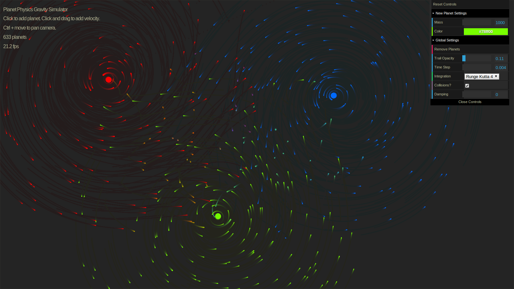

# N-body Gravity Simulation

## Run

[See it in action](https://lemmingapex.github.io/PlanetsGravitySimulator/)

Open index.html in google chrome.

## About

A [N-body simulation](https://en.wikipedia.org/wiki/N-body_simulation) of [Newton's law of universal gravitation](https://en.wikipedia.org/wiki/Newton%27s_law_of_universal_gravitation) written in javascript.

Numerical Integration methods: [Euler](https://en.wikipedia.org/wiki/Euler_method), [Runge–Kutta 4](https://en.wikipedia.org/wiki/Runge%E2%80%93Kutta_methods), [Verlet](https://en.wikipedia.org/wiki/Verlet_integration).

Calculating accelerations in O(_n2_) time.  Would like to include a [Barnes-Hut](https://en.wikipedia.org/wiki/Barnes%E2%80%93Hut_simulation) option to do this calculation in O(_n*log(n)_).

Control GUI from [dat.gui](https://github.com/dataarts/dat.gui)
